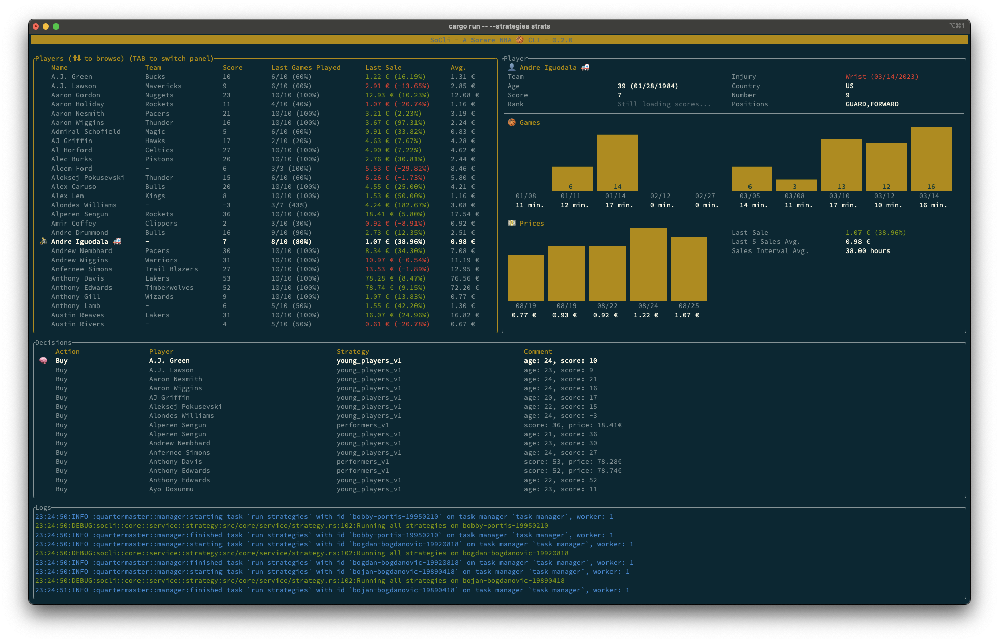

# SoCli - A Sorare NBA 🏀 CLI 



## Main features

- Player stats retrival and browsing
- JavaScript based decision engine

> Does only work for with `limited` rarity levle cards at the moment.


## Installation

### From sources

#### Rust

In order to compile Rust developpment environment must be setup.
Follow official install instructions here: https://www.rust-lang.org/tools/install (it is actually a single line script !).

#### Install with cargo

This cargo command downloads sources, builds and installs the tool on the system:

```bash
$ cargo install --git https://github.com/zippy1978/socli.git --bin socli 
```

#### Verify

Verify that the the tool is ready for use with:

```bash
$ socli --help
SoCli - A Sorare NBA 🏀 CLI

Usage: socli [OPTIONS] --strategies <STRATEGIES>

Options:
  -s, --strategies <STRATEGIES>  Strategy scripts folder path
  -r, --reset                    Reset stored data
  -h, --help                     Print help information
  -V, --version                  Print version information
```

## Usage

### Launch

In order to run, the tools needs only one argument: the strategy scripts folder path.
If you don't have a scripts yet, you can leave the folder empty for the moment.

Then run with:

```bash
$ socli -s strats
# Where `strats` is the path to the strategy scripts folder
```

On first start the program looks at all Sorare NFT cards to extract NBa players. This may take sometime, but once done the player list is cached for next launches.

The cache can be cleared when launching with the `-r`switch:

```bash
$ socli -s strats -r
# Forces player reload on startup
```


### Commands

- [Ctrl+C] or [Q]: exit
- Tab to switch selected panel
- Contextual keys are displayed on the active panel


## Writing strategy scripts

### Example

A strategy script is a simple JavaScript script called on player, eveytime his data are updated.
The goal of such a script is to apply computation on player data to (possibly) output a decision.

Here is a simple strategy script template:

```js
// A strategy script defines a single `decide` function
// Player data is passed as argument to the function
export function decide(player) {

  // Decides to buy every playe with a score above 40
  if (player.stats.score > 40) {
  	// Returns a decision
  	return {
  	   // Action to take
      action: "Buy",
      // Comment of the decision
      comment: `this player score is ${player.stats.score}!`,
    };
  }

}
```

> **Note**: scripts inside the strategy folder are dynamically loaded. Meaning that it is possible to add or debug a new script without restarting the tool.
> Script errors are outputed to the log console.

### Player data model

```js
{
	slug: string,
	display_name: string,
	birth_date: string,
	team?: string,
	prices: [
		{
			date: string,
			eur: string,
			usd: string,
		},
		...
	],
	stats?: {
		score: number,
		games: [
			{
				date: string,
				did_play: bool,
				minutes_played: number,
				score: number,
			},
			...
		]
	}
}
```
